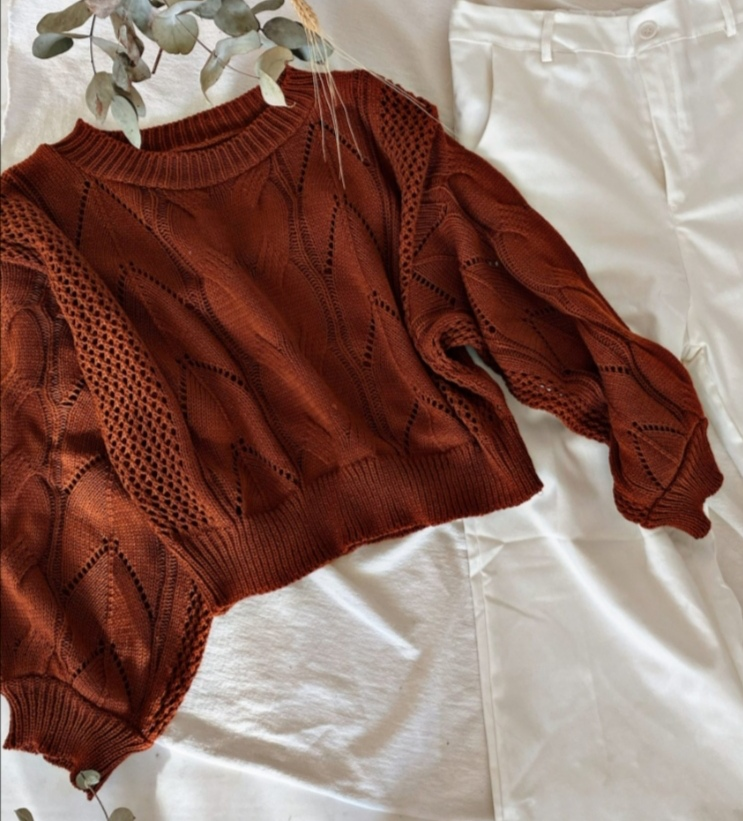

# Bienvenido al repositorio de DICLOSUREINC 💫

This project was bootstrapped with [Create React App](https://github.com/facebook/create-react-app).

Este proyecto ha sido creado con la versión 17.0.2 de React. Su funcionalidad principal es la de un e-commerce 

## Instalación

Clona el repositorio con el siguiente comando

### `git clone https://github.com/APao-dev/disclosureinc.git`

Una vez finalizada la clonación, ejecuta en la consola

### `npm install`

Y luego ejecuta...

### `npm start`

La aplicación se recargará automáticamente si cambia alguno de los archivos de origen.

### Introducción

DisclosueInc nace desde un emprendimiento de indumentaria el cual pretende ser creativo, de fácil acceso y, sobre todo, seguro para las compras on-Line 

## Aprende más sobre react

Para aprender React, consulta la documentación de React en el siguiente enlace [React documentation](https://reactjs.org/).

